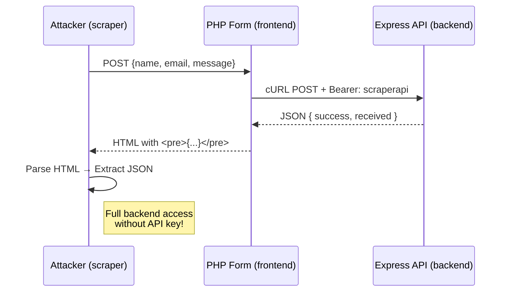

# **Frontend Proxy Bypass**  
### *A Full-Stack Security Proof-of-Concept (PoC) Demonstrating API Key Bypass via Public Frontend Form*

> **Repository**: `https://github.com/mmycin/Frontend-Proxy-Bypass`  
> **Purpose**: **Educational** – Show how **protected backend APIs** can be **indirectly accessed** through **trusted frontend clients**, even with strong authentication.  
> **Warning**: For **learning and security testing only**. Do not deploy in production.

---

## Overview

This project demonstrates a **critical architectural flaw** in web applications:

> **Even if your backend API requires an API key, if a public-facing frontend includes that key and forwards user input — attackers can bypass authentication entirely.**

It implements a **multi-tier attack chain**:

```
[Attacker] 
   → [Public PHP Form] 
       → [Protected Express API] 
           ← Only accepts Bearer: scraperapi
   ← [Response embedded in HTML]
← [Scraper parses HTML → gets JSON]
```

**No API key needed by the attacker.**

---

## Project Structure

```
Frontend-Proxy-Bypass/
│
├── backend/                  # Node.js + Express (Protected API)
│   ├── src/
│   │   ├── index.ts          # Main server
│   │   └── middleware/
│   │       └── auth-header.ts # API Key validation
│   └── package.json
│
├── frontend/                 # Public PHP Form (The Proxy)
│   ├── index.php             # Form + cURL to backend
│   └── .env                  # Contains API key (DANGEROUS)
│
├── scraper/                  # Attacker's Tool (FastAPI)
│   └── main.py               # Submits to PHP → extracts backend response
│
└── README.md                 # This file
```

---

## Components Explained

---

### 1. `backend/` – **Protected Node.js API**

#### `src/index.ts`

```ts
const app = express();
app.use(express.json());

app.get("/public", ...)     // Open to all
app.post("/protected", authorizeWithApiKey, ...) // Requires Bearer token
```

- Runs on `http://localhost:3000`
- **Only `/protected`** is secured
- Uses `API_KEY` from environment

#### `middleware/auth-header.ts`

```ts
const VALID_API_KEYS = process.env.API_KEY || "";
```

**Note**: Currently treats `API_KEY=key1,key2` as a **single string**, not array.  
In this PoC: `API_KEY=scraperapi` → works.

```ts
if (apiKey === VALID_API_KEYS) next();
else res.status(403).json({ message: "Forbidden" });
```

**Security**: Strong **if** the key stays secret.

---

### 2. `frontend/` – **The Proxy (PHP Form)**

#### `index.php`

```php
$apiToken = $env['API_TOKEN']; // = scraperapi
curl_setopt($ch, CURLOPT_HTTPHEADER, [
    "Authorization: Bearer $apiToken"
]);
```

- **Public form** (Name, Email, Message)
- On submit → PHP:
  1. Sanitizes input (`htmlspecialchars`)
  2. JSON-encodes payload
  3. **cURL POST** to `http://localhost:3000/protected`
  4. **Includes API key in header**
  5. Displays **raw backend response** in `<pre>`

#### `.env`

```env
API_TOKEN=scraperapi
API_URL=http://localhost:3000/protected/
```

> **Critical Flaw**: The **API key is stored on a public-facing server**  
> Anyone who can submit the form → triggers **authenticated backend calls**

---

### 3. `scraper/` – **Attacker's Exploitation Tool**

#### `main.py`

```python
@app.post("/protected")
def submit_form(data: FormData):
    response = requests.post(PHP_FORM_URL, data=data.dict())
    soup = BeautifulSoup(response.text, "html.parser")
    pre = soup.select_one("div.output pre")
    json_str = html.unescape(pre.text)
    return json.loads(json_str)
```

- Runs **FastAPI server** (`localhost:8000`)
- Accepts JSON input
- **Submits form data** to PHP page
- **Parses HTML** to extract `<pre>` containing backend JSON
- Returns **clean JSON response**

> **Attacker never touches the API key**  
> Uses **frontend as proxy**

---

## Full Attack Flow (Step-by-Step)



---

## How to Run (Local Setup)

### Prerequisites

| Tool | Version |
|------|--------|
| Node.js | >= 14 |
| PHP | >= 7.4 (with cURL) |
| Python | >= 3.8 |
| npm/yarn | latest |

---

### Step 1: Start Backend

```bash
cd backend
npm install
API_KEY=scraperapi npm start
# → http://localhost:3000
```

### Step 2: Start PHP Server

```bash
cd ../frontend
php -S localhost:8080
# → Open http://localhost:8080 in browser
```

### Step 3: Start Attacker (Scraper)

```bash
cd ../scraper
pip install fastapi uvicorn requests beautifulsoup4 lxml
uvicorn main:app --reload --port 8000
# → http://localhost:8000
```

---

### Step 4: Test the Bypass

#### Option A: Via Browser
1. Go to `http://localhost:8080`
2. Fill form → Submit
3. See backend JSON in blue box

#### Option B: Via cURL (Attacker Simulation)

```bash
curl -X POST http://localhost:8000/protected \
  -H "Content-Type: application/json" \
  -d '{
    "name": "Malicious User",
    "email": "hack@evil.com",
    "message": "I bypassed your auth!"
  }'
```

**Expected Output**:

```json
{
  "success": true,
  "data": {
    "message": "Success! You accessed the protected route...",
    "received": {
      "name": "Malicious User",
      "email": "hack@evil.com",
      "message": "I bypassed your auth!"
    }
  }
}
```

**No API key used. Full access granted.**

---

## Security Analysis

| Risk | Severity | Description |
|------|----------|-----------|
| **API Key Exposure** | Critical | Key stored in `.env` on public server |
| **Frontend Proxy** | Critical | Public form acts as authenticated client |
| **No CSRF Protection** | High | Form can be submitted from anywhere |
| **HTML Response Parsing** | Medium | Scraper relies on fragile DOM structure |
| **No Rate Limiting** | Medium | Can be used for spam/DoS |

---

## How to Fix (Best Practices)

| Issue | Secure Alternative |
|------|---------------------|
| API key in frontend | **Never store secrets in client-accessible code** |
| Frontend calls backend directly | Use **backend-to-backend auth** (mTLS, internal JWT) |
| No CSRF | Add **CSRF tokens** or **SameSite cookies** |
| HTML scraping | Return **JSON API**, not embed in HTML |
| Static API key | Use **short-lived tokens**, **OAuth2**, or **client certificates** |
| No logging | Log all form submissions with IP, user-agent |

---

## Educational Value

This PoC teaches:

1. **Authentication ≠ Authorization**
   - Just requiring a key isn't enough if it's leaked.

2. **Frontend should never be trusted**
   - Any public endpoint with secrets is a proxy.

3. **Defense in Depth**
   - Protect at **multiple layers**: network, app, data.

4. **Why SSRF matters**
   - Even without direct server access, forms can be abused.

---

## Real-World Analogies

- **Contact forms sending emails via backend** (if backend trusts form)
- **Admin dashboards with embedded API keys**
- **Mobile apps hardcoding backend tokens**

---


## License

```
MIT License
```

Free to use, modify, and distribute for **educational and security testing purposes**.

---


## Final Warning

> **This is a security demonstration.**  
> **Never deploy this pattern in production.**  
> **Treat all frontend code as public.**

---

> **"Your API is only as secure as its weakest client."**  
> — *Frontend Proxy Bypass PoC*
